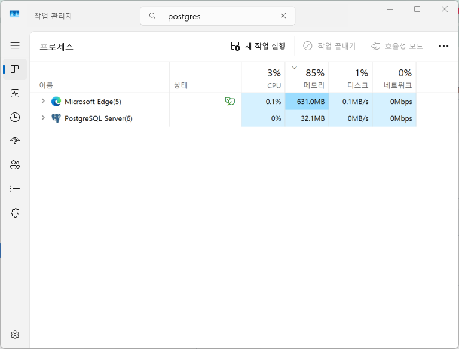

# PostgreSQL 기본구동
1. DB구동 및 종료
2. DB접속 및 데이터베이스와 사용자 생성
3. 사용자계정 접속으로 Table 생성  
4. Data CRUD 명령
5. DB 백업 및 복구
---

1. DB구동 및 종료
```
Run run 'pg_ctl start' or 'pg_ctl stop' to start and stop the database or
register it as a service by running 'pg_ctl register -N PostgreSQL' from an elevated shell.
Default superuser login: postgres, password: <blank>
```

- 구동 : `pg_ctl start`
- 중지 : `pg_ctl stop`
- 등록 : `pg_ctl register -N PostgreSQL`
- 관리자 : pgAdmin4 실행 <br/> 
  `윈도우 돋보기에서 pgAdmin4 검색 후 클릭`
- Tip. 설치후 바로 구동하면 안되는 경우, 새로운 Command 창을 띄우고 실행하면 된다.
<br/>
<br/>

2. DB접속 및 데이터베이스와 사용자 생성
- DB 구동후 접속 <br/>
```
PS C:\> pg_ctl start
서버를 시작하기 위해 기다리는 중....2025-04-25 15:07:28.295 KST [11780] LOG:  starting PostgreSQL 17.4 on x86_64-windows, compiled by msvc-19.42.34436, 64-bit
2025-04-25 15:07:28.304 KST [11780] LOG:  listening on IPv6 address "::1", port 5432
2025-04-25 15:07:28.304 KST [11780] LOG:  listening on IPv4 address "127.0.0.1", port 5432
2025-04-25 15:07:28.550 KST [21936] LOG:  database system was shut down at 2025-04-25 15:06:53 KST
2025-04-25 15:07:28.612 KST [11780] LOG:  database system is ready to accept connections
 완료
서버 시작됨

PS C:\> psql -U postgres 
psql (17.4)
도움말을 보려면 "help"를 입력하십시오.

postgres=#

```



- DB조회 : \l or \list<br/> 
```
postgres-# \l
                                             데이터베이스 목록
   이름    |  소유주  | 인코딩 | 로케일 제공자 | Collate | Ctype | 로케일 | ICU 룰 |      액세스 권한
-----------+----------+--------+---------------+---------+-------+--------+--------+-----------------------
 postgres  | postgres | UTF8   | libc          | C       | en    |        |        |
 template0 | postgres | UTF8   | libc          | C       | en    |        |        | =c/postgres          +
           |          |        |               |         |       |        |        | postgres=CTc/postgres
 template1 | postgres | UTF8   | libc          | C       | en    |        |        | =c/postgres          +
           |          |        |               |         |       |        |        | postgres=CTc/postgres
(3개 행)

```
- DB사용자 생성, 사용자역할(Role) 조회 : \dg or \du <br/>
```
postgres=# CREATE USER test_user WITH PASSWORD 'test1234';
CREATE ROLE

postgres-# \dg
                          롤 목록
  롤 이름  |                      속성
-----------+------------------------------------------------
 postgres  | 슈퍼유저, 롤 만들기, DB 만들기, 복제, RLS 통과
 test_user |

```
<style> 
    .indented { text-indent: 30px; /* 들여쓰기 크기 설정 */ } 
</style>
### Options
<p align="left">
<dl class="indented"> 
    <dt> psql &emsp;:</dt> 
    <dd>PostgreSQL의 명령줄 인터페이스(CLI) 도구입니다. <br/> 이를 통해 데이터베이스에 접속하고 SQL 명령을 실행할 수 있습니다. </dd>
    <dt> -U &emsp;: </dt>
    <dd>특정 사용자를 지정하기 위한 옵션입니다. </dd>
    <dt> postgress &emsp;: </dt>
    <dd>접속하려는 PostgreSQL 사용자의 이름입니다. <br/> 기본적으로 PostgreSQL 설치 시 생성되는 슈퍼유저 계정이 **postgres** 입니다. </dd>
</dl>
</p>

- DB생성
```
postgres=# CREATE DATABASE test_db WITH ENCODING='utf-8' OWNER test_user;
CREATE DATABASE

postgres=# \list
                                             데이터베이스 목록
   이름    |  소유주   | 인코딩 | 로케일 제공자 | Collate | Ctype | 로케일 | ICU 룰 |      액세스 권한
-----------+-----------+--------+---------------+---------+-------+--------+--------+-----------------------
 postgres  | postgres  | UTF8   | libc          | C       | en    |        |        |
 template0 | postgres  | UTF8   | libc          | C       | en    |        |        | =c/postgres          +
           |           |        |               |         |       |        |        | postgres=CTc/postgres
 template1 | postgres  | UTF8   | libc          | C       | en    |        |        | =c/postgres          +
           |           |        |               |         |       |        |        | postgres=CTc/postgres
 test_db   | test_user | UTF8   | libc          | C       | en    |        |        |
(4개 행)

postgres=# \q
PS C:>


```    
<br/>
<br/>

3. 사용자계정 접속으로 Table 생성  
```
PS C:\> psql -U test_user -d test_db
psql (17.4)
도움말을 보려면 "help"를 입력하십시오.

test_db=> 
CREATE TABLE TB_ADMIN (
    ADMIN_NO Serial NOT NULL,
    LOGIN_ID Varchar(20) NOT NULL UNIQUE,
    PASSWD   Varchar(20) NOT NULL,
    NICK     Varchar(20) NOT NULL,
    EMAIL    Varchar(40),
    PRIMARY KEY (ADMIN_NO)
) Without Oids;
CREATE TABLE
test_db=>
test_db=> \d tb_admin
                                      "public.tb_admin" 테이블
  필드명  |         형태          | 정렬규칙 | NULL허용 |                   초기값
----------+-----------------------+----------+----------+--------------------------------------------
 admin_no | integer               |          | not null | nextval('tb_admin_admin_no_seq'::regclass)
 login_id | character varying(20) |          | not null |
 passwd   | character varying(20) |          | not null |
 nick     | character varying(20) |          | not null |
 email    | character varying(40) |          |          |
인덱스들:
    "tb_admin_pkey" PRIMARY KEY, btree (admin_no)
    "tb_admin_login_id_key" UNIQUE CONSTRAINT, btree (login_id)


test_db=> select * from tb_admin;
 admin_no | login_id | passwd | nick | email
----------+----------+--------+------+-------
(0개 행)


test_db=>

```
<br/>
<br/>

4. Data CRUD 명령


<br/>
<br/>

5. DB 백업 및 복구
